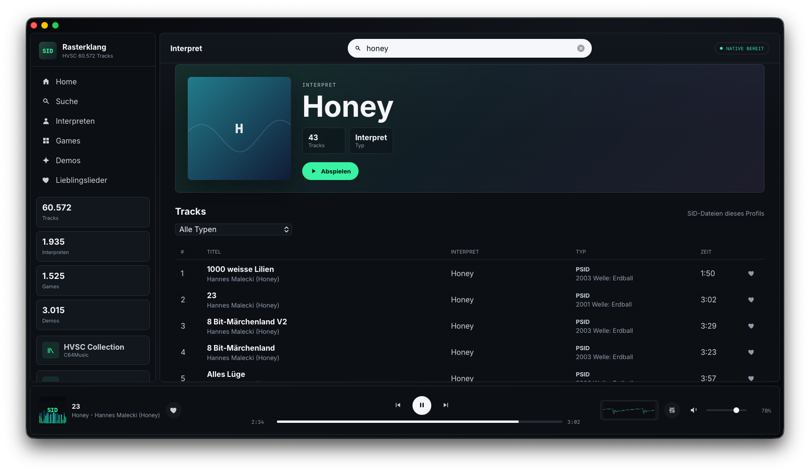
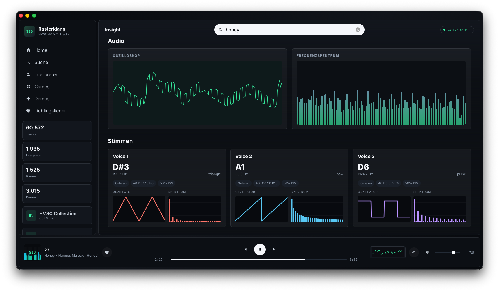

# Rasterklang Desktop

[](https://github.com/dnoegel/rasterklang-desktop/actions/workflows/ci.yml)
[](https://github.com/dnoegel/rasterklang-desktop/actions/workflows/release.yml)

| Search | Insight |
| --- | --- |
|  |  |

`rasterklang-desktop` is the native desktop player for Rasterklang. It packages the
shared web player interface with a local Go/Wails shell and plays HVSC SID files
through the native `github.com/dnoegel/rasterklang-cli` audio engine.

The UI and catalog browsing experience are shared with `rasterklang-webplayer`, but
audio playback, HVSC folder selection, configuration, equalizer state, and
debug snapshots are handled locally by the desktop app.

## Run

```sh
cd rasterklang-desktop
make run
```

`make run` syncs the bundled web UI, generates the app icon, and starts the app
with the Wails tags `desktop,production`.

On first launch, use the `HVSC Collection` button in the sidebar and select
your local `C64Music` folder, or a parent folder that contains `C64Music`. The
selection is stored in the platform user config directory.

Favorites are stored as track IDs in `favorites.json` next to `config.json` in
the platform user config directory. On macOS this is usually
`~/Library/Application Support/rasterklang`; on Linux it is usually
`$XDG_CONFIG_HOME/rasterklang` or `~/.config/rasterklang`. Existing
favorites from the older WebView `localStorage` key are imported on startup.

## Support Boundaries

The desktop app uses the shared Rasterklang SID engine through a native Go/Wails
shell. It supports local PSID/RSID files and HVSC-style folder browsing, but it
does not bundle HVSC, C64 ROM images, BASIC/KERNAL ROMs, or uncleared third-party
SID files.

### Unsupported Tune Behavior

Unsupported RSID/BASIC/ROM edge cases may fail to play, produce silence, or
sound different from hardware or libsidplayfp-based players. The desktop app
should keep those cases visible as unsupported tune states rather than hiding
the tune or implying complete C64 emulation.

### Native Feature Gaps

The desktop app is a native HVSC/library player first. It shares the webplayer
UI, but not every browser/WASM workflow is implemented through the Wails bridge
yet:

- browser-local `.sid` upload playback is wired into the native bridge. Uploaded
  bytes are parsed locally, kept in memory, and played through the native Go
  audio engine without requiring an HVSC root.
- Instruction stepping is still WASM/debugger-only. The native bridge can expose
  playback snapshots from the Go engine, but it does not yet provide a step
  instruction API for the shared Insight/lesson tools.
- debug bridge parity is incomplete. Native playback state, local snapshots,
  scope samples, audio controls, and equalizer state are available; trace
  streams and instruction stepping still need explicit desktop bridge methods
  before they can be advertised as desktop features.

## Build

```sh
make build
```

This creates `bin/rasterklang-desktop`. The web UI, app icon, and
`hvsc-library.json` manifest are embedded into the binary. HVSC SID files stay on your local disk.

The app icon is generated from `scripts/generate-icon.go` into:

- `build/appicon.png`
- `build/appicon.svg`

Wails uses `build/appicon.png` for application icons and platform packaging.

## Smoke Test

```sh
make smoke
```

The smoke target builds the desktop binary, starts it with `--smoke`, validates
the embedded webplayer assets and `hvsc-library.json`, initializes the native
app bridge, reads library/playback/favorites state, and exits before opening a
GUI window. `make check` runs this smoke so release builds fail if the embedded
frontend or native startup path is broken.

## Release Artifacts

```sh
VERSION=v0.1.0 make dist
```

### Platform Caveats

- macOS releases are `.app.zip` archives for the current macOS release runner
  architecture. They are not signed or notarized yet, so Gatekeeper may require
  manual approval on first launch.
- Linux releases are `.tar.gz` archives and `.deb` packages for the current
  release runner architecture. The app requires GTK/WebKitGTK and ALSA runtime
  libraries from the distribution.
- No Windows desktop artifact is produced for the first desktop release
  candidate. Keep Windows claims out of release copy until a Wails Windows build
  and smoke path exist.
- No native package channels are published yet. The first desktop release
  candidate uses GitHub Release downloads plus the generated Debian package;
  Homebrew cask, apt repository, winget, and other channel work remains separate
  release follow-up.

### Platform Support Matrix

| Platform | First release artifact | Install path | Signing/package status |
| --- | --- | --- | --- |
| macOS release runner architecture | `.app.zip` | GitHub Release download, then open `Rasterklang.app` manually | Not signed or notarized; first launch may require Gatekeeper approval |
| Linux amd64 on the release runner | `.tar.gz` and `.deb` | GitHub Release download or Generated Debian package with `sudo apt install ./rasterklang-desktop_0.1.0_amd64.deb` | Requires distro GTK/WebKitGTK/ALSA runtime libraries; no apt repository yet |
| Windows | none | none | Unsupported for the first release candidate; add Wails/WebView2 CI, smoke coverage, and a package path before advertising Windows desktop support |

### Build Metadata

Release binaries print embedded build metadata:

```sh
rasterklang-desktop --version
```

`make build` and `make dist` inject `BUILD_VERSION`, `COMMIT`, and `DATE` with
Go linker flags. `VERSION=v0.1.0 make dist` uses that release tag as the build
version; development builds derive `BUILD_VERSION` from `git describe` when
`VERSION` is left at its default `dev` value.

On macOS this creates a versioned `.app.zip` plus `.sha256` file under `dist/`.
On Linux it creates a versioned `.tar.gz` containing the binary, desktop entry,
icon, README, license, and notices, plus a `.sha256` file. Linux release builds
also create a Debian package such as `rasterklang-desktop_0.1.0_amd64.deb` plus
a `.sha256` file.

### Release Provenance

Desktop archives and Debian packages include `RELEASE_PROVENANCE.json`. It
records the desktop version, source commit, build date, source repository,
artifact target, dirty-source flag, pinned webplayer asset version, optional
webplayer artifact checksum, and available GitHub Actions run context.

This is a machine-readable build record, not a signed notarization or
cryptographic attestation. macOS signing/notarization and package-channel
attestations remain separate release follow-up work.

The Debian package installs the binary, desktop entry, icon, and release
documentation:

```sh
sudo apt install ./rasterklang-desktop_0.1.0_amd64.deb
```

Release builds should consume a pinned `rasterklang-webplayer` UI artifact rather
than the sibling checkout fallback:

```sh
VERSION=v0.1.0 \
ASSET_VERSION=v0.1.0 \
WEBPLAYER_ARTIFACT=/path/to/rasterklang-webplayer-ui-v0.1.0.tar.gz \
WEBPLAYER_ARTIFACT_SHA256=<sha256> \
make dist
```

The GitHub release workflow accepts the exact webplayer artifact URL and SHA-256
as `workflow_dispatch` inputs:

- `webplayer_artifact_url`
- `webplayer_artifact_sha256`
- `asset_version`
- `desktop_version`

Tag-triggered release runs can still use repository variables
`WEBPLAYER_ARTIFACT_URL` and `WEBPLAYER_ARTIFACT_SHA256`. In both modes, the
release workflow also validates that `WEBPLAYER_ARTIFACT_URL` and
`WEBPLAYER_ARTIFACT_SHA256` match `webplayer.lock` before downloading the
artifact. The workflow then verifies the checksum, builds macOS and Linux
artifacts, and publishes the generated archives/checksums to `desktop_version`.
Artifact metadata must also declare `provenance.sourceDirty` as `false`; release
sync refuses artifacts built from dirty webplayer source even when their checksum
matches the supplied SHA-256.

### Webplayer Lock Preflight

```sh
make webplayer-lock-preflight
```

This verifies `webplayer.lock` points at a published
`rasterklang-webplayer-ui` GitHub release asset with a recorded SHA-256 checksum.
The desktop release path runs this preflight before packaging, so the first
desktop release cannot be built from the sibling checkout fallback or from a
`pending-first-release` lock.

### Standalone Preflight

```sh
make standalone-preflight
```

This verifies the desktop app can resolve its public Go module graph without
local workspace help by running `GOWORK=off go mod download all`. The current
release candidate depends on `github.com/dnoegel/rasterklang-cli@v0.1.0`; publish
the canonical core repository/tag and align module paths before cutting a public
desktop release.

### Release Identity Preflight

```sh
make identity-preflight
```

This verifies the release checkout is pointed at the public
`dnoegel/rasterklang-desktop` repository and that `go.mod` declares
`github.com/dnoegel/rasterklang-desktop`. Fix the origin remote, module path,
README links, and release workflow URLs before tagging if this preflight fails.

## Install

```sh
make install
```

On macOS, this builds `build/Rasterklang.app` and installs it to
`/Applications`.

```sh
INSTALL_APP_DIR="$HOME/Applications" make install
```

On Linux, this installs the binary as `rasterklang-desktop`, plus a desktop entry and
icon under `PREFIX`.

```sh
PREFIX="$HOME/.local" make install
```

## Dependencies

Linux needs the Wails/WebKitGTK development packages for your distribution.
On Debian/Ubuntu:

```sh
sudo apt-get install build-essential pkg-config libgtk-3-dev libwebkit2gtk-4.0-dev libasound2-dev
```

macOS needs the Xcode command line tools:

```sh
xcode-select --install
```

The Makefile adds the Wails linker flags required for
`UniformTypeIdentifiers` on macOS.

## Architecture

- `../rasterklang-webplayer` is the source for the shared UI: shell, sections, player,
  catalog logic, and CSS.
- `frontend/overrides` contains only the desktop-specific frontend layer:
  Wails bootstrap, native engine bridge, and Wails bindings.
- `frontend/dist` is generated from webplayer sources plus overrides. Do not
  edit it directly; `make run`, `make build`, and `make sync-webplayer`
  regenerate it.
- `frontend/dist/src/lib/native-engine.js` exposes the same frontend API as the
  browser engine, but delegates playback to Wails/Go.
- `app.go` provides native dialogs, HVSC root configuration, and playback API
  methods.
- `audio.go` renders SID audio with `github.com/dnoegel/rasterklang-cli` and outputs it
  through Oto.

## Desktop/Webplayer Contract

`rasterklang-webplayer` owns the shared shell, catalog, route, and presentation
modules. `rasterklang-desktop` consumes a versioned webplayer UI artifact and
adds only the native layer needed to run inside Wails.

The desktop override boundary is intentionally small:

- `frontend/overrides/app.js` may replace bootstrapping, Wails startup, local
  HVSC root selection, and wiring of native services into the shared shell.
- `frontend/overrides/src/lib/native-engine.js` may replace browser audio with
  Wails-backed playback, native upload-byte loading, native equalizer/audio
  controls, local snapshots, and playback-state polling.
- `frontend/overrides/src/lib/native-favorites.js` may replace browser
  `localStorage` favorites with native config-directory persistence and legacy
  migration.
- `frontend/overrides/wailsjs/go/main/App.js` is a generated-style bridge
  shim for local development and contract checks.

Overrides must not override shared shell, catalog, route, or presentation modules.
If desktop needs a new capability, add it to the shared webplayer contract first,
then implement the native bridge in desktop.

`rasterklang-webplayer.json` is the machine-readable contract inside the
webplayer artifact. Desktop checks these fields before release:

- `name` must match `webplayer.lock.package`.
- `version` and `assetVersion` must match the `ASSET_VERSION` used for sync.
- `provenance.sourceDirty` must be `false` for release artifacts.
- `bridgeApiVersion` must match `webplayer.lock.bridgeApiVersion`.
- `requiredDesktopCapabilities` must match
  `webplayer.lock.requiredDesktopCapabilities`.
- Every required desktop capability must be implemented by both
  `frontend/dist/wailsjs/go/main/App.js` and `app.go`.

Desktop release preflight also checks `webplayer.lock` itself: `status` must be
`released`, `artifact.url` must point at the published GitHub Release tarball,
the release tag and archive name inside `artifact.url` must match
`webplayer.lock.version`, and `artifact.checksumSha256` must contain the exact release asset SHA-256.
When validating release workflow inputs, the supplied artifact URL and SHA-256
must exactly match `webplayer.lock.artifact.url` and
`webplayer.lock.artifact.checksumSha256`.

### Bridge Compatibility Rule

Breaking changes to required Wails bridge calls require a bridgeApiVersion bump
in `rasterklang-webplayer`, an updated `webplayer.lock`, and a matching desktop
implementation in the same release train. Additive bridge capabilities can keep
the same `bridgeApiVersion` only when older desktop builds can safely ignore
them. Desktop release sync rejects a webplayer artifact when its declared
`requiredDesktopCapabilities` differ from the lock, so CI cannot package an
unreviewed native bridge contract change.

## Sync The Web UI

```sh
make sync-webplayer
```

The source directory and asset version can be overridden:

```sh
WEBPLAYER_DIR=../rasterklang-webplayer ASSET_VERSION=dev make sync-webplayer
```

### Tracked Generated Frontend Snapshot

`frontend/dist is intentionally tracked` as the desktop app's embedded Wails
frontend snapshot. It lets local `go build`, `go test`, and smoke checks verify
the desktop binary without requiring every contributor to rebuild the shared UI
first.

Do not hand-edit frontend/dist. Refresh it only through `make sync-webplayer`,
`make build`, or `make dist`, then review the resulting snapshot together with
the matching webplayer source, artifact metadata, or `webplayer.lock` change.

Release builds must provide WEBPLAYER_ARTIFACT and WEBPLAYER_ARTIFACT_SHA256 so
the snapshot comes from a pinned `rasterklang-webplayer-ui` release artifact.
Sibling checkout sync is a development fallback only.
